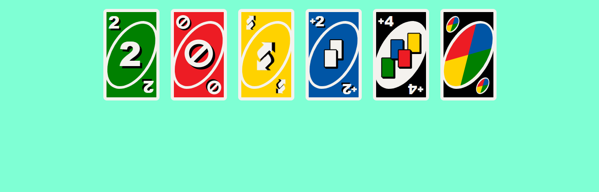

# CSS UNO Cards Visualizer

> Built as part of the freeCodeCamp Responsive Web Design Certification.

## Overview
It's a page that shows a set of uno cards designed to meet a freeCodeCamp certification project's requirements. You can add cards and change their colors/numbers/functions by adding and altering divs following the pre-existing element labeling logic. I might add more card variety in the future.

## freeCodeCamp Modules Covered

### HTML

`Basic HTML` • `Semantic HTML` • `Forms and Tables` • `Accessibility`

### CSS

`Basic CSS` • `Design` • `Absolute and Relative Units` • `Pseudo Classes and Elements` • `Colors` • `Styling Forms` • `The Box Model` • `Flexbox`

## Design Decisions

While the certification prompt called for generic playing cards, I chose to implement uno cards to tackle more complex CSS styling and layout challenges.